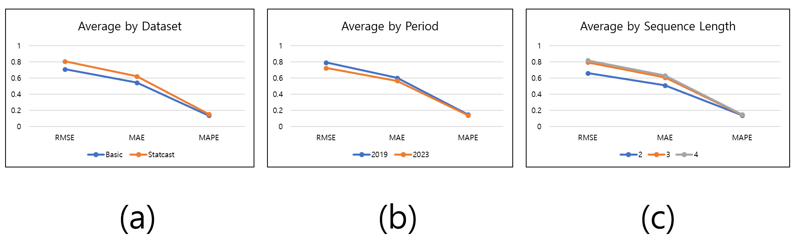

# Pitcher Performance Prediction Major League Baseball (MLB) 

## Introduction

This study aims to predict the Earned Run Average (ERA) of Major League Baseball (MLB) pitchers using deep learning techniques. By analyzing historical data and various performance metrics, we strive to create a model that can provide accurate ERA predictions, helping teams make informed decisions.

## Dataset

In this study, we used data from 2015-2023 of mlb pitchers. We divided the criteria into Basic and Statcast to distinguish basic baseball statistical data and data collected with the latest technology. After that, it was used for training the proposed model, and the results were compared with existing projection systems. More information is available in the data folder.

### Source:

Main trained data (Basic, Statcast) : Baseball Savant (https://baseballsavant.mlb.com/statcast_search)

Projection data : Fangraphs (ZiPS, ATC, Depth Charts, Steamer, and THE BAT) (https://www.fangraphs.com)

## Code

The source code is divided into basic and statcast folders according to the data learned first. The next step is divided into 2019 and 2023 folders according to the predicted year. Finally, the models tested for each sequence length can be checked. For a detailed description of each code, refer to the notes to the code.

### Requirements

- Python 3.11.3
- Tensorflow 2.12.0
- Libraries are stated above the code.

In addition, correlation_winrate.ipynb compares the correlation between the era ranking and the winning rate ranking of mlb clubs from 2000-2023.
prediction_2024.ipynb is a prediction of 2024 ERA for the two best models selected in all experimented models.

## Results

- In dataset variation, Basic dataset showed better performance.
- In period variation, targeting 2023 showed better performance.
- In sequence length variation, sl=2 showed best performance.

More detailed results and benchmarks tables are in result1.xlsx

## Contribution

In this study, the proposed model with TFT 

## Contact

### Wonbyung Lee

- on M.Sc. degree in Applied Artificial Intelligence at SungKyunKwan University, Seoul, South Korea.
- Research Interests : Sports data science, computer science, deep learning, LLM.
- E-mail : co279727@gmail.com
- Google scholar : https://scholar.google.com/citations?user=6QaU2dsAAAAJ&hl=ko