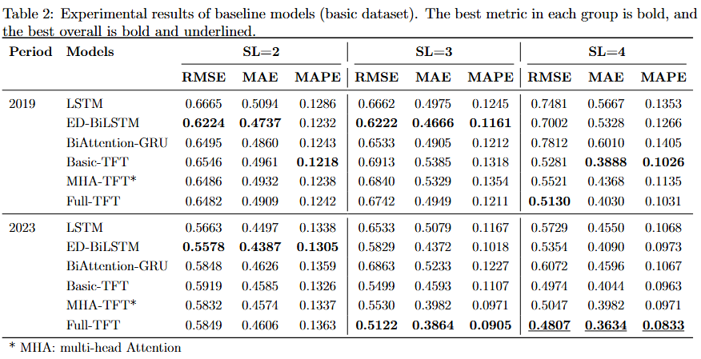
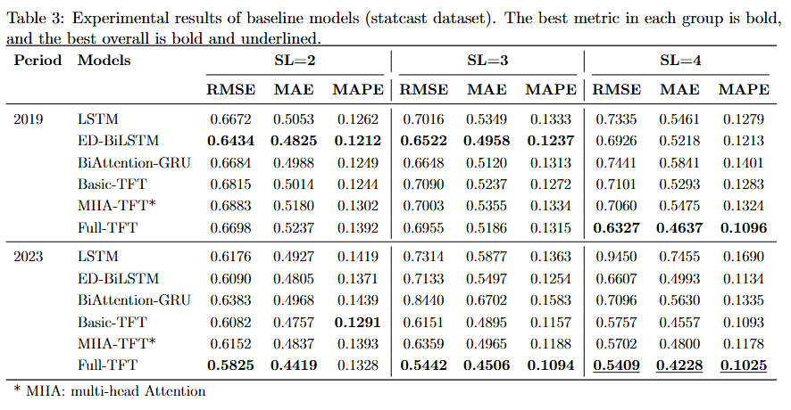
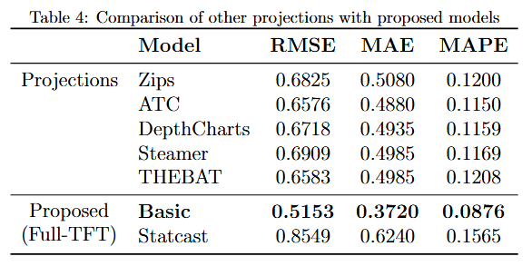

# Pitcher Performance Prediction Major League Baseball (MLB) 

## Introduction

This study aims to predict the Earned Run Average (ERA) of Major League Baseball (MLB) pitchers using deep learning techniques. By analyzing historical data and various performance metrics, we strive to create a model that can provide accurate ERA predictions, helping teams make informed decisions.

## Dataset

In this study, we used data from 2015-2023 of mlb pitchers. We divided the criteria into Basic and Statcast to distinguish basic baseball statistical data and data collected with the latest technology. After that, it was used for training the proposed model, and the results were compared with existing projection systems. More information is available in the data folder.

### Source:

Main trained data (Basic, Statcast) : Baseball Savant (https://baseballsavant.mlb.com/statcast_search)

Projection data (ZiPS, ATC, Depth Charts, Steamer, and THE BAT) : Fangraphs (https://www.fangraphs.com)

## Code

The source code is divided into basic and statcast folders according to the data learned first. The next step is divided into 2019 and 2023 folders according to the predicted year. Finally, the models tested for each sequence length can be checked. For a detailed description of each code, refer to the notes to the code.

- This experiment was conducted using 13 neural network models.
After conducting an initial round of testing, the best-performing models from each category were selected for the final experiments. Final 6 choosen models :

    LSTM_A (LSTM)
    
    Biattention-GRU (GRU)

    ED-BiLSTM (BiLSTM)

    All TFT-based models

### Requirements

- Python 3.11.9
- Tensorflow 2.13.0
- Libraries are stated above the code.

In addition, correlation_winrate.ipynb compares the correlation between the era ranking and the winning rate ranking of mlb clubs from 2000-2023.
prediction_2024.ipynb is a prediction of 2024 ERA for the two best models selected in all experimented models.

## Results

### Experimental Results (Basic Dataset)

### Experimental Results (Statcast Dataset)

This table presents the performance comparison of various baseline models using the Basic Dataset and Statcast Dataset.
The evaluation is conducted across different sequence lengths (SL=2, SL=3, SL=4) using three metrics: RMSE, MAE, and MAPE.

🔍 Key Findings:

- ED-BiLSTM and Full-TFT models generally perform the best across different settings.
- Full-TFT achieves the best overall performance for SL=4, showing strong predictive accuracy.
- In terms of MAPE, Full-TFT consistently achieves the lowest values, indicating higher relative accuracy.

### Comparison Results (Proposed vs Projection systems)

This table compares the performance of various projection models with the proposed Full-TFT model across three evaluation metrics: RMSE, MAE, and MAPE.

🔍 Key Insights:

- The proposed Full-TFT (Basic Dataset) model outperforms all other projections, achieving the lowest RMSE (0.5153), MAE (0.3720), and MAPE (0.0876).

## Contribution

In this study, the performance of the proposed model using tft was excellent. Even in comparison with existing projection systems, there were many cases of predicting closer to the actual ERA. These advancements in player performance prediction technologies can have a significant impact on the sports industry in the future and present a positive direction for both clubs and players.

## Contact

### Wonbyung Lee

- M.S. course in Applied Artificial Intelligence at SungKyunKwan University, Seoul, South Korea.
- Research Interests : Sports data science, computer science, deep learning, LLM.
- E-mail : co279727@gmail.com
- Google Scholar : https://scholar.google.com/citations?hl=ko&user=6QaU2dsAAAAJ
- Github : https://github.com/wonbyunglee
